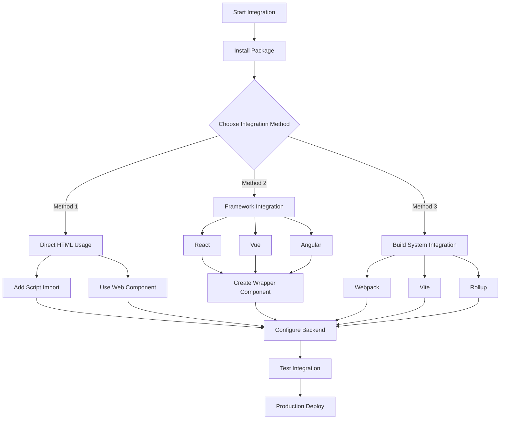
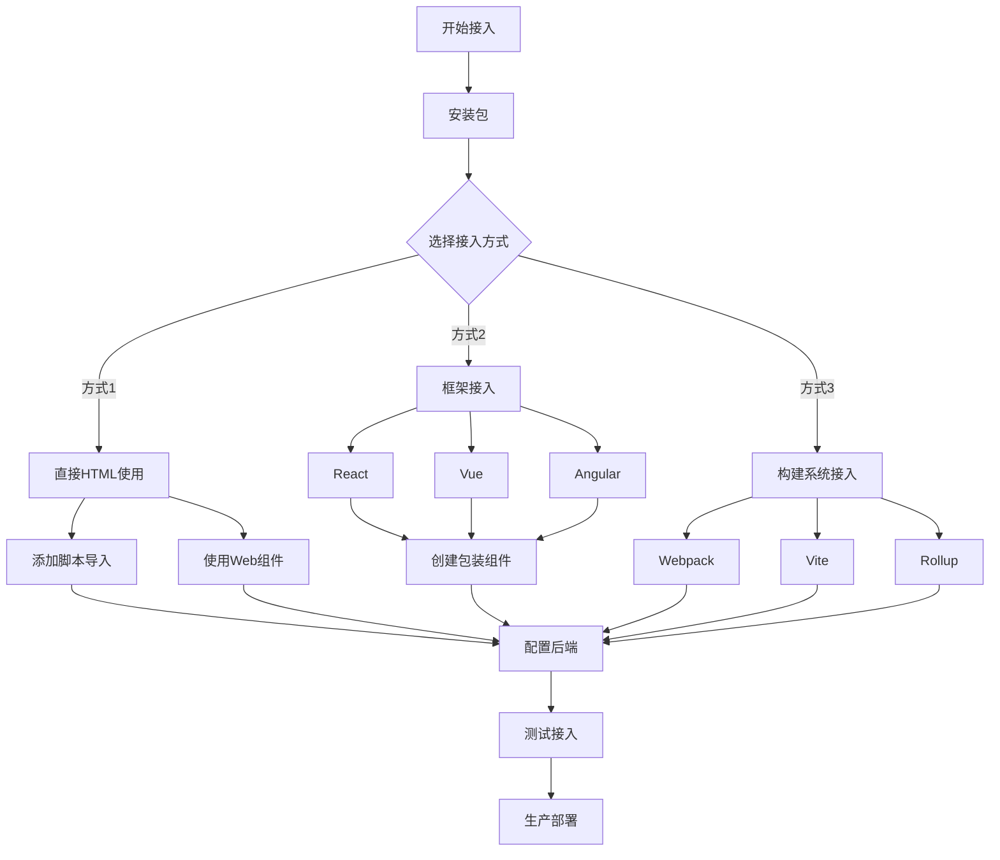

# 框架接入流程图 | Integration Flowchart

[English](#english) | [中文](#chinese)

<h2 id="english">English</h2>

## Integration Flowchart



## Integration Steps

1. **Package Installation**

   ```bash
   npm install ai-textarea-completion
   ```

2. **Choose Integration Method**

   - Direct HTML Usage
   - Framework Integration
   - Build System Integration

3. **Framework-Specific Setup**

   - React Setup
   - Vue Setup
   - Angular Setup

4. **Backend Configuration**

   - API Setup
   - Environment Variables
   - Error Handling

5. **Testing & Deployment**
   - Integration Testing
   - Performance Testing
   - Production Deployment

---

<h2 id="chinese">中文</h2>

## 接入流程图



## 接入步骤

1. **包安装**

   ```bash
   npm install ai-textarea-completion
   ```

2. **选择接入方式**

   - 直接HTML使用
   - 框架接入
   - 构建系统接入

3. **框架特定设置**

   - React设置
   - Vue设置
   - Angular设置

4. **后端配置**

   - API设置
   - 环境变量
   - 错误处理

5. **测试和部署**
   - 集成测试
   - 性能测试
   - 生产部署
